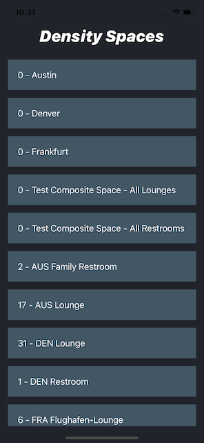

# Density Spaces

### Installation
1: Clone the directory with: `git clone https://github.com/ahadcove/dense-hw.git`
2: CD into the director and run: `npm i`
3: Start the Bundler with: `npm run start`
4: Start the iOS or Android simulator: `npm run ios` or `npm run android`
5: Sit back and watch the rooms fill :)
